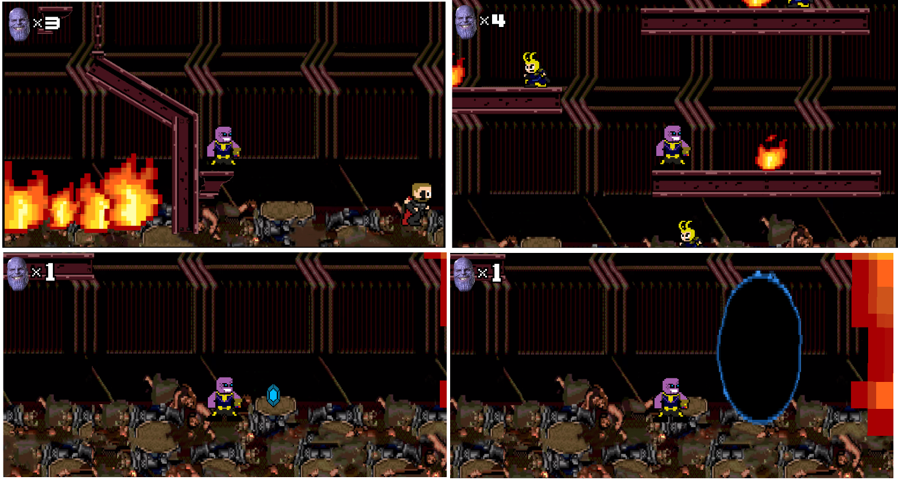
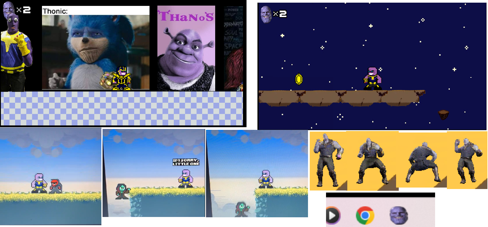

# Infinity War The Video Game

-This was my first game. No limits or worries of copyright due to it being a 'practice excersise' but turned out amazing.
 
 the levels are based on the film: 
 level 1 = thors ship
 level 2 = planet titan
 level 3 = battle on earth (no photos available :(      )
 cutscene level = thanos' farm

 

[watch the end cutscene here](https://youtu.be/kbTqX8ScaqQ)
 

      
  
      
  
  
  
  
  

     
    

