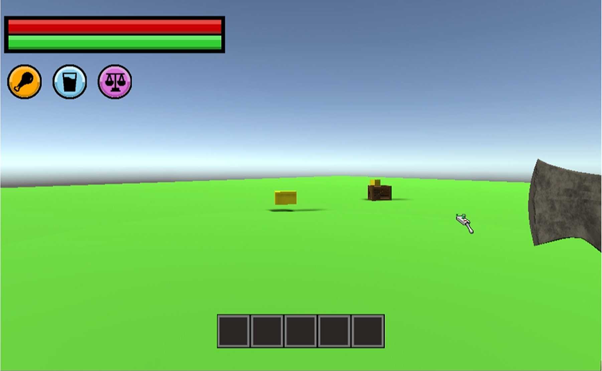
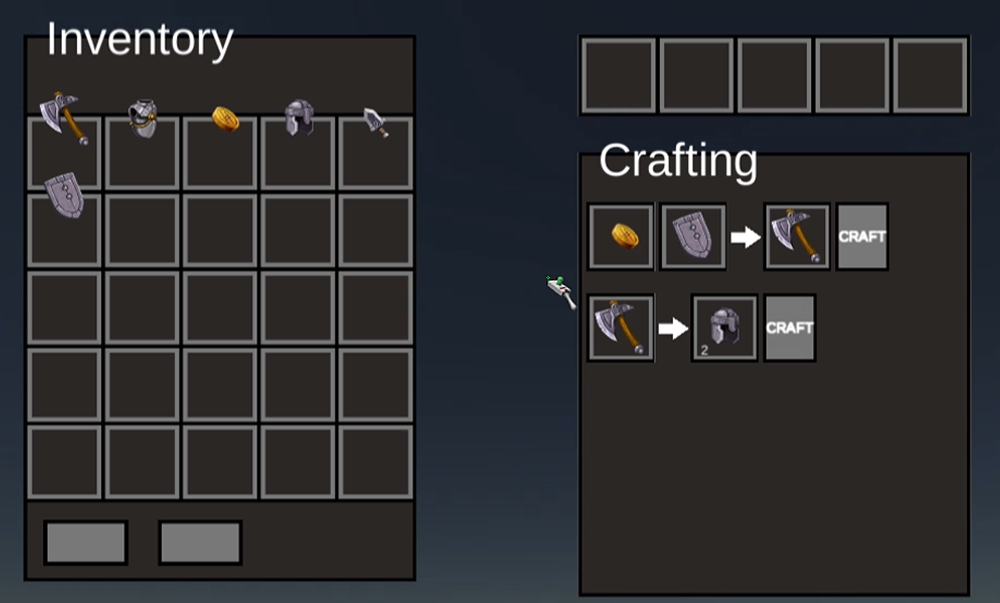
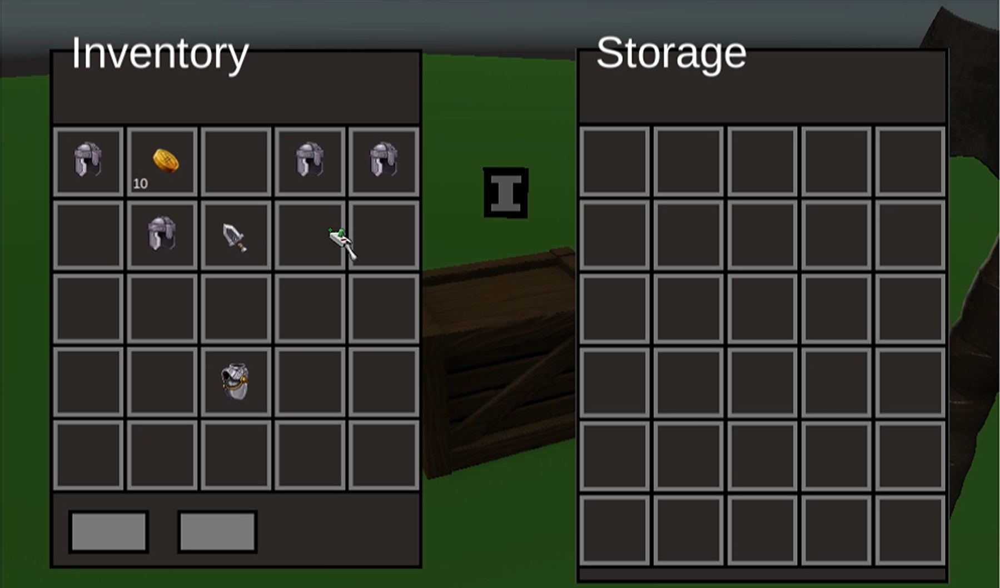

# Survival game

-This was my fourth game. I loved survival games so I wanted to try my hand at making one. I had great inspiration for the UI thanks to "Bioshock Infinite", however, that was the main highlight of this as I ran into massive issues with the code all throughout the project resulting in less progress than I planned.

[play my game](https://tonystarkofwinterfell.github.io/KeevoWebGL/.html)

 

      
  
  

      
    

