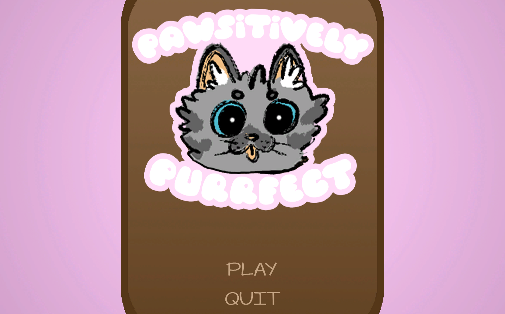
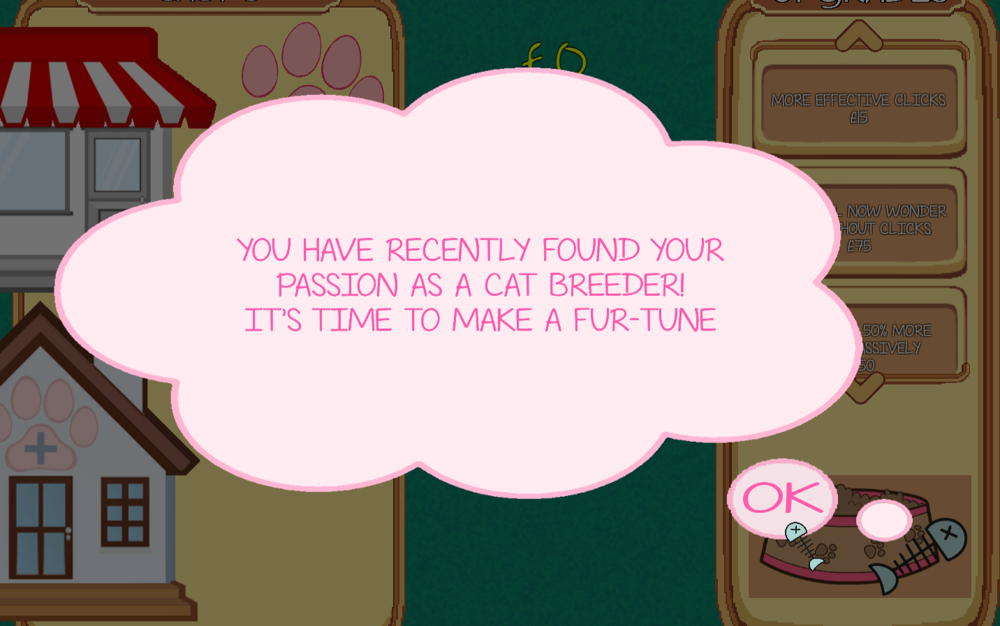
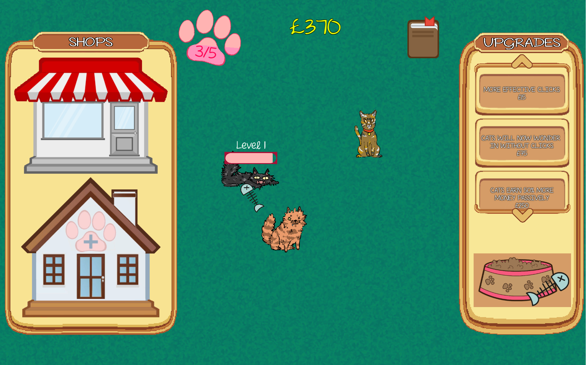
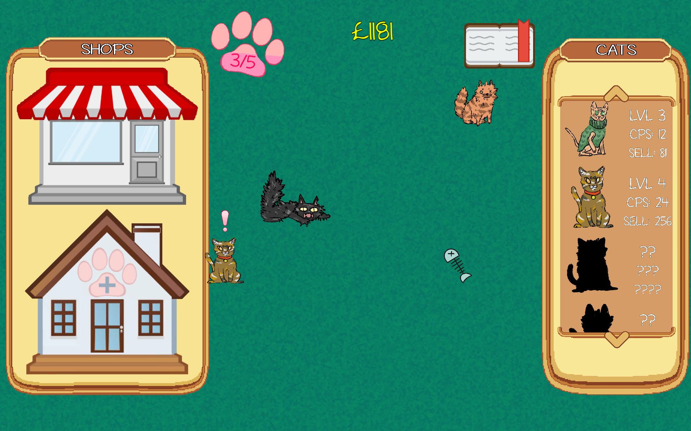
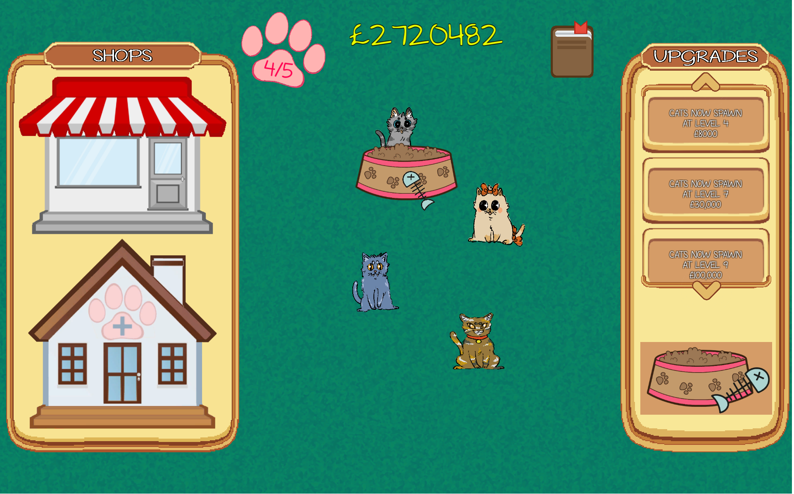
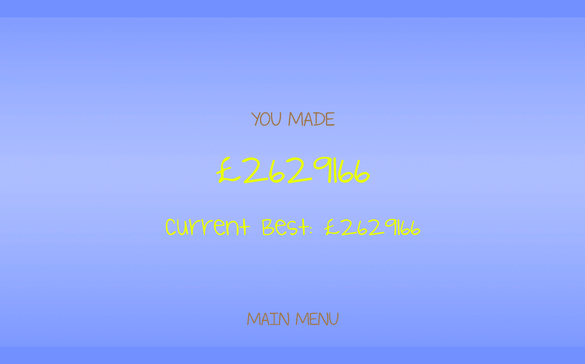

# FMP / Pawsitively Purrfect

-This is it...the final major project. Possibly my biggest and most ambitious project out of all of my games and my joint favourite (alongside infinity war). I had inspiration from a 'merger' indie game and...who doesn't love cats? 
 
Fun fact: This game was only made possible thanks to the help of my digital art partner from the reskin project, as by asking for a favour, they were kind enough to make the cat sprites for me because finding anything close to what I wanted, ESPECIALLY being copyright free, would be near impossible to find online given how specific the premise is.
 
This was fun to make as almost everyone in my class enjoyed the conecpt and looked forward to the final result. After completing the game, I sent a copy to the digital arts student and thanked them, only to get a reply not long after, where they mentioned showing it off to their own class and it recieving possitive feedback there too.

[play my game](https://tonystarkofwinterfell.github.io/finalPawsitiveBuild/.html)

 

    
  
  
  
  
  

      
    

