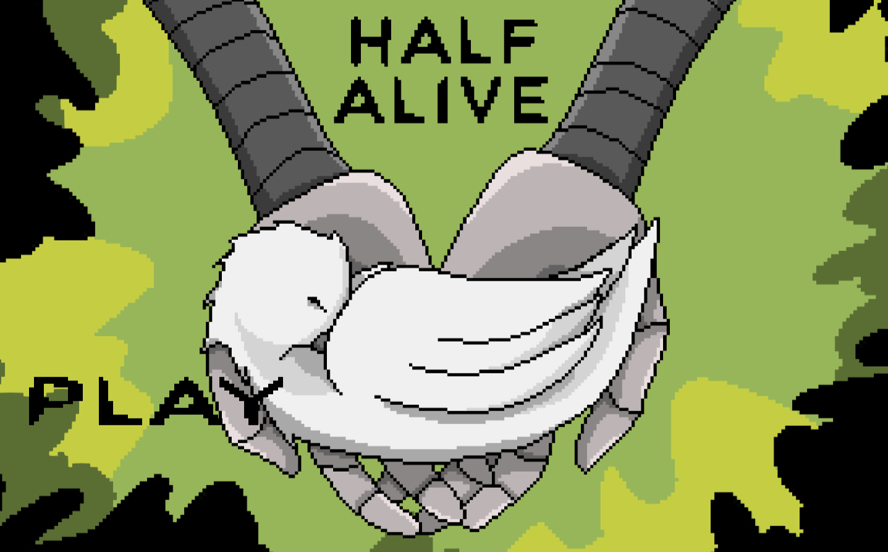
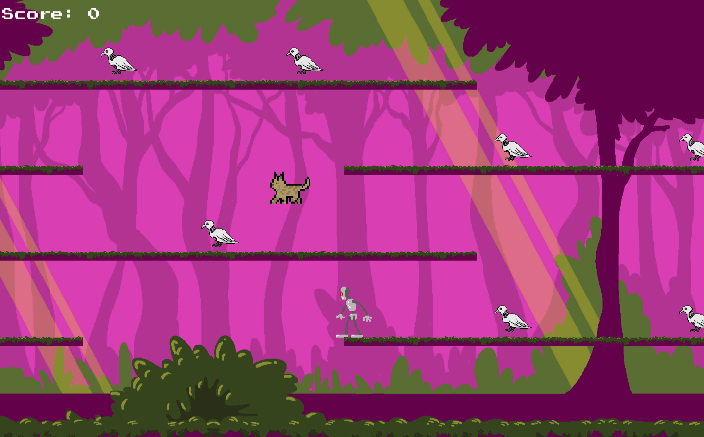
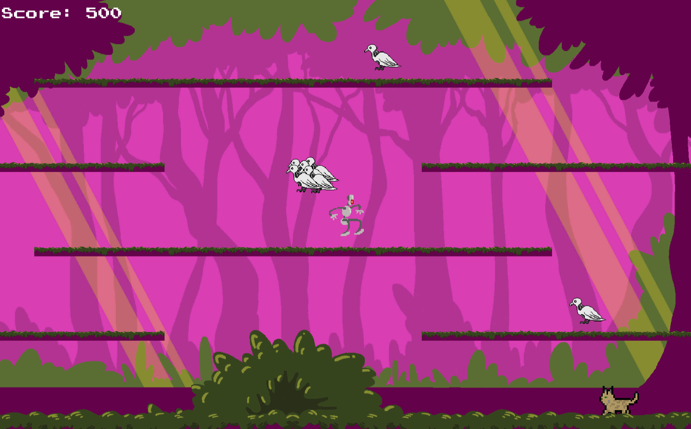
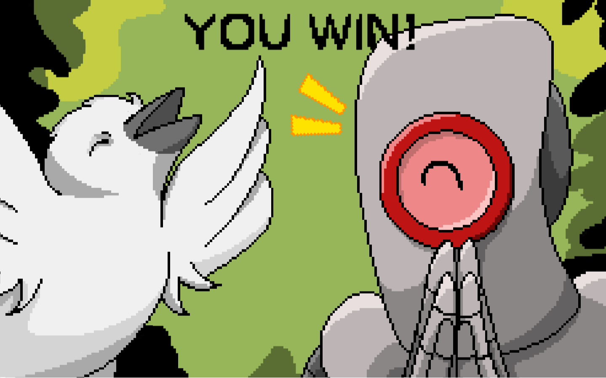

# Reskin collab class

-This isn't a new game but instead a collaboration project between the games-making-class and the digital-arts-class, where we were assigned a partner from the opposite class as a mock run of what it's like working with others, similar to in the real industry, with things like requesting what you need and dont need, overly specifying every detail about each asset you ask for and bouncing ideas back and fourth on how to improve the project further. 
 
 
I chose my 'Raccoon game' to reskin as I liked the mechanics but my art was...lacking...to say the least.

 

[play my game](https://tonystarkofwinterfell.github.io/FReskinWeb/.html)

 

      
  
  
  
 
    

